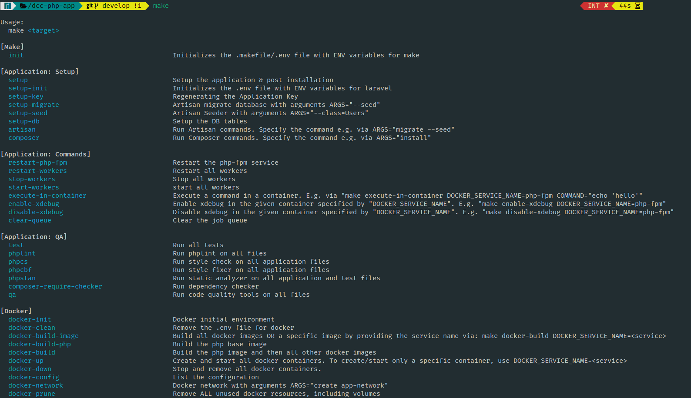

## Docker Compose For PHP App (`Laravel`)

This system are using technology stack as follow:

-   Laravel 9.x
-   PHP 8.1
-   Supervisor
-   Composer 2
-   Nginx 1.22 (Stable)
-   Logger (logrotate)
-   MySQL 8 (for local development)
-   Redis 7 (for local development)
-   Docker (custom images)
-   Makefile (for setup docker images and setup application)

## Setup Docker Images

Create docker images with `stable/latest` **Docker** version (`v20.*.*`) and **Docker compose plugin** compose version `v2`

> Installation instruction read the [doc](https://docs.docker.com/engine/install/) then select OS platform or use `Docker desktop`

Setup for create docker images:

-   [x] PHP Base
-   [x] PHP-FPM
-   [x] PHP Worker (CLI & supervisor)
-   [x] Application
-   [x] Nginx
-   [x] Logger

| Service                   | Version | OS                 | Development | Staging | Production |
| ------------------------- | ------- | ------------------ | ----------- | ------- | ---------- |
| PHP Base + Composer V2    | 8.1     | Alpine 15          | yes         | yes     | yes        |
| PHP-FPM                   | 8.1     | Alpine 15          | yes         | yes     | yes        |
| PHP Worker (supervisor)   | 8.1     | Alpine 15          | yes         | yes     | yes        |
| Application               | 8.1     | Alpine 15          | yes         | yes     | yes        |
| Nginx                     | 1.22    | Alpine 15          | yes         | yes     | yes        |
| Logger (cron & logrotate) | -       | Alpine 15          | yes         | yes     | yes        |
| MySQL                     | 8       | Oraclelinux:8-slim | yes         | no      | no         |
| Redis                     | 7       | Alpine 16          | yes         | no      | no         |

Base project from [Docker PHP Tutorial](https://github.com/paslandau/docker-php-tutorial)
Thank's to [Pascal Landau](https://github.com/paslandau) 👍

### Makefile Help command

```bash
make
```

<p align="center">
    
</p>

### Initializes Make base of Environment (Development or Production)

Fist of all create image base from environment

```bash
make init
```

Please update your `.make/.env` file with your settings

```ini
DOCKER_REGISTRY=docker.io  # Docker Registry
DOCKER_NAMESPACE=asapdotid # Docker namespace
COMPOSE_DOCKER_CLI_BUILD=1 # Docker Compose BuildKit is enabled by default: 1 | 0
DOCKER_BUILDKIT=1          # Docker BuildKit is enabled by default: 1 | 0
ENV=development            # Environment: development | production
TIMEZONE=Asia/Jakarta      # Timezone
APP_USER_NAME=application  # User
APP_USER_ID=1000           # User ID
APP_GROUP_ID=1000          # Group ID
APP_PROJECT=asaplabs       # Docker project name
```

## Setup Application base of Environment

Setup for the Laravel projects:

-   [x] Copy ENV
-   [x] Composer Install
-   [x] Composer Post Install and Generate Key
-   [x] Setup other

### Initializes Application base of Environment

Setup application (`laravel`) environment:

```bash
make setup-init
```

Please update your `.docker/.env` file with your settings

```ini
# docker-compose env vars
# @see https://docs.docker.com/compose/reference/envvars/
COMPOSE_CONVERT_WINDOWS_PATHS=1

# application
APP_GROUP_NAME=application

# application
APP_SSH_PASSWORD=123456

# timezone
TIMEZONE=Asia/Jakarta

# domain name for support traefik production
TRAEFIK_ENABLE=true
TRAEFIK_ENTRYPOINT=https # For development use http
TRAEFIK_DOMAIN_NAME=subdomain.example.com

APP_CODE_PATH_CONTAINER=/var/www/app
# APP_CODE_PATH_HOST is relative to the location of the first docker-compose.yml file that is used for docker-compose
APP_CODE_PATH_HOST=/home/application/__change_with_app_dir__ # Applicaltion source code location
APP_HOST=app.example
# Docker compose networks
NETWORKS_DRIVER=bridge
NETWORKS_EXTERNAL=true
# Nginx Ports config if needed
NGINX_HOST_HTTP_PORT=80
NGINX_HOST_HTTPS_PORT=443
# make PhpStorm recognize incoming debug connections
# see https://www.jetbrains.com/help/phpstorm/debugging-a-php-cli-script.html
PHP_IDE_CONFIG=serverName=asapdotid

# mysql development
MYSQL_PASSWORD=secret
MYSQL_ROOT_PASSWORD=secret_mysql_root_password
# redis development
REDIS_PASSWORD=secret_redis_password

# Docker image version
ALPINE_VERSION=3.15
COMPOSER_VERSION=2
NGINX_VERSION=1.22-alpine
PHP_VERSION=8.1
# Docker image version for development
MYSQL_VERSION=8
REDIS_VERSION=7-alpine
```

For Development:

-   `Traefik` docker compose config with `labels:` and you can custom `TRAEFIK_ENABLE=true`, `TRAEFIK_ENTRYPOINT=http`, `TRAEFIK_DOMAIN_NAME=domain.com` with your domain name. For development entrypoint `TRAEFIK_ENTRYPOINT=http`
-   With `Traefik` you can access `http://domain.com`
-   Mysql default database name: `application_db`
-   Please change Mysql Password (root & user) & Redis Password

### Build Docker Images

Build docker images command:

```bash
make docker-init
make docker-build
```

### Setup Laravel Application

#### Install Composer:

```bash
make composer ARGS="install"
```

#### Artisan command (`php artisan`) with `ARGS=""`

```bash
make artisan ARGS=""
```

#### Generate Key (`php artisan key:generate`)

```bash
make setup-key
```

#### Migrate Database (`php artisan migrate`) with `ARGS=""`

```bash
make setup-migrate ARGS=""
```

#### Seed Database (`php artisan db:seed`) with `ARGS=""`

```bash
make setup-seed ARGS="--class=ClassSeeder"
```

Change `ARGS=""` content inside double quote.

#### Optional:

```bash
make composer ARGS="run-script post-create-project-cmd"
```

## Running Application in Docker Container

Setup for docker:

-   [x] Running Container
-   [x] Stop Container
-   [x] Prune Images

### Running Containers

```bash
make docker-up
```

### Stop container

```
make docker-down
```

### Remove Images

```
make docker-prune
```

## License

MIT / BSD

## Author Information

This Docker Compose PHP App (Laravel) was created in 2022 by [Asapdotid](https://github.com/asapdotid) 🚀
